# NewsHub - Modern News Portal Website

Sebuah website portal berita modern dengan desain minimalis, navigasi yang intuitif, dan sistem routing yang responsif. Portal ini menampilkan berita terkini dari berbagai kategori dengan layout yang optimal untuk semua ukuran layar.

## 🌐 Link Deployment
https://newshub-portal.vercel.app/

## 🚀 Fitur Utama

### 🎨 **Visual & User Experience**
- **Responsive Design** yang optimal di desktop, tablet, dan mobile
- **Smooth Animations** dengan fade-in effects dan hover transitions
- **Modern Typography** dengan hierarki yang jelas dan mudah dibaca
- **Category Filtering** dengan pill-style buttons yang interaktif
- **Featured Article** showcase dengan gradient overlay yang menarik

### 📱 **Interactive Features**
- **Article Routing** - Navigasi antar halaman dengan slug-based URLs
- **Category Filter** - Filter berita berdasarkan kategori secara real-time
- **Mobile Menu** - Hamburger menu dengan animasi smooth untuk mobile
- **Article Cards** - Hover effects dengan scale dan shadow transitions
- **Reading Statistics** - View count, reading time, dan publish date

### 🧭 **Navigation & Routing**
- **Custom Router** - Simple routing system tanpa external dependencies
- **Breadcrumb Navigation** - Back button dan navigation history
- **SEO-Friendly URLs** - Slug-based article URLs untuk SEO optimization
- **Browser History** - Support untuk browser back/forward buttons

### 📰 **Content Management**
- **Rich Article Content** - HTML formatting dengan proper typography
- **Author Profiles** - Author information dengan avatar dan bio
- **Article Tags** - Tag system untuk kategorisasi yang lebih detail
- **Related Articles** - Smart recommendations berdasarkan kategori
- **Social Features** - Share dan bookmark functionality

## 📁 Struktur Project

```
news-portal/
├── public/
│   └── vite.svg             # Favicon dan assets public
├── src/
│   ├── components/
│   │   ├── Header.jsx       # Navigation header dengan menu
│   │   ├── HomePage.jsx     # Halaman utama dengan grid layout
│   │   ├── ArticlePage.jsx  # Halaman detail artikel
│   │   ├── FeaturedArticle.jsx # Komponen artikel unggulan
│   │   ├── NewsCard.jsx     # Card komponen untuk artikel
│   │   ├── CategoryFilter.jsx # Filter kategori interaktif
│   │   └── Footer.jsx       # Footer dengan link dan info
│   ├── data/
│   │   └── mockNews.js      # Mock data artikel dengan konten lengkap
│   ├── utils/
│   │   └── router.js        # Custom routing implementation
│   ├── App.jsx              # Main component dengan router
│   ├── main.jsx             # Entry point aplikasi
│   └── index.css            # Tailwind CSS + custom styles
├── index.html               # HTML template
├── package.json             # Dependencies dan scripts
├── tailwind.config.js       # Tailwind configuration
├── postcss.config.js        # PostCSS configuration
└── vite.config.js           # Vite build configuration
```

## 🛠️ Teknologi yang Digunakan

### **Frontend Framework**
- **React 18.2.0** - Component-based UI library dengan hooks
- **Vite 5.1.4** - Fast build tool dengan hot module replacement

### **Styling & UI Framework**
- **Tailwind CSS 3.4.1** - Utility-first CSS framework
- **Lucide React 0.263.1** - Modern icon library dengan 1000+ icons
- **PostCSS 8.4.35** - CSS transformation dan optimization
- **Autoprefixer 10.4.16** - Automatic CSS vendor prefixes

### **Routing & Navigation**
- **Custom Router** - Lightweight routing solution tanpa external deps
- **Browser History API** - Native browser navigation support
- **URL Slug System** - SEO-friendly article URLs

### **Development Tools**
- **ESLint 8.56.0** - Code linting untuk code quality
- **Vite Dev Server** - Fast development server dengan HMR

## 🔄 Flowchart Pembuatan

```mermaid
graph TD
    A[🚀 Project Setup] --> B[⚙️ Install Dependencies]
    B --> C[🎨 Setup Tailwind CSS]
    C --> D[📱 Create Components]
    
    D --> E[🧭 Header Component]
    D --> F[🏠 HomePage Layout]
    D --> G[📰 Article Components]
    D --> H[🔗 Router System]
    D --> I[📊 Data Structure]
    
    E --> J[📱 Mobile Menu]
    F --> K[📑 Featured Article]
    F --> L[🎯 Category Filter]
    F --> M[📦 News Grid]
    G --> N[📖 Article Page]
    G --> O[🏷️ Tags System]
    
    H --> P[🔗 URL Routing]
    P --> Q[📍 Navigation]
    Q --> R[🔙 Back Navigation]
    
    I --> S[📰 Mock Articles]
    S --> T[👤 Author Data]
    T --> U[🏷️ Categories & Tags]
    
    J --> V[📱 Responsive Design]
    K --> V
    L --> V
    M --> V
    N --> V
    O --> V
    R --> V
    U --> V
    
    V --> W[✨ Animations & Transitions]
    W --> X[🔧 Performance Optimization]
    X --> Y[🚀 Deployment]
    
    style A fill:#ff6b6b
    style Y fill:#51cf66
    style H fill:#339af0
    style W fill:#ffd43b
    style I fill:#845ef7
```



## 🚀 Cara Menjalankan Project

### **Prerequisites**
- Node.js 16+ 
- npm atau yarn
- Browser modern dengan ES6+ support

### **Installation**
```bash
# Clone repository
git clone <repository-url>
cd news-portal

# Install dependencies
npm install

# Setup Tailwind CSS
npm install -D tailwindcss postcss autoprefixer
npx tailwindcss init -p

# Install icon library
npm install lucide-react

# Run development server
npm run dev

# Build untuk production
npm run build

# Preview build
npm run preview
```

### **Development Scripts**
```bash
npm run dev      # Start development server (localhost:5173)
npm run build    # Build untuk production
npm run lint     # Check code quality dengan ESLint
npm run preview  # Preview production build
```

## 📐 Key Features Implementation

### **Responsive Grid System**
- **Desktop (1280px+)**: 3-column artikel grid untuk browsing optimal
- **Laptop (1024-1279px)**: 2-column layout dengan spacing yang nyaman
- **Tablet (768-1023px)**: 2-column dengan touch-friendly spacing
- **Mobile (<768px)**: Single column dengan vertical scrolling

### **Custom Router Implementation**
```javascript
// Simple routing tanpa external dependencies
const Router = ({ children }) => {
  const [currentPath, setCurrentPath] = useState(window.location.pathname);
  
  const navigate = (path) => {
    window.history.pushState({}, '', path);
    setCurrentPath(path);
  };
  
  return React.cloneElement(children, { currentPath, navigate });
};
```

### **Dynamic Content Filtering**
- Real-time category filtering tanpa page reload
- Animated transitions saat content berubah
- Responsive filter pills dengan horizontal scroll
- State management untuk selected category

### **Article Page Features**
- **Rich Content Rendering** dengan HTML dangerouslySetInnerHTML
- **Author Profiles** dengan avatar dan bio information
- **Social Actions** seperti share, bookmark, dan reading stats
- **Related Articles** berdasarkan kategori yang sama
- **Tag System** untuk topik navigation

### **Performance Optimizations**
- **Component Lazy Loading** untuk faster initial load
- **Image Optimization** dengan proper aspect ratios
- **Smooth Animations** dengan CSS transitions dan transforms
- **Mobile-First Design** dengan progressive enhancement

## 🎯 Content Structure

### **Article Data Model**
```javascript
{
  id: Number,
  slug: String,              // SEO-friendly URL
  title: String,
  summary: String,
  content: String,           // HTML content
  category: String,
  author: String,
  publishedAt: String,
  readTime: String,
  image: String,             // Hero image URL
  views: String,             // View count
  tags: Array,               // Related tags
  featured: Boolean          // Featured article flag
}
```

### **Category System**
- **All** - Semua artikel
- **Economy** - Ekonomi dan bisnis
- **Technology** - Teknologi dan inovasi
- **Environment** - Lingkungan dan iklim
- **Sports** - Olahraga dan kompetisi
- **Health** - Kesehatan dan medis
- **Science** - Sains dan penelitian

## 📱 Browser Support & Compatibility

- **Chrome 90+** - Full support dengan optimal performance
- **Firefox 88+** - Complete compatibility
- **Safari 14+** - iOS dan macOS support
- **Edge 90+** - Windows integration
- **Mobile Browsers** - Touch-optimized interface

## 🎨 Design System

### **Color Palette**
- **Primary**: Blue-Purple gradient (#3B82F6 → #8B5CF6)
- **Background**: Light gray (#F9FAFB)
- **Text**: Dark gray (#111827, #374151, #6B7280)
- **Accent**: Blue (#2563EB)

### **Typography**
- **Headings**: Font weights 600-700 dengan proper line height
- **Body**: System fonts dengan fallback untuk cross-platform
- **Hierarchy**: Clear visual hierarchy dengan size dan weight

### **Spacing & Layout**
- **Grid**: CSS Grid dengan responsive breakpoints
- **Padding**: Consistent spacing scale (4, 6, 8, 12, 16, 24px)
- **Margins**: Vertical rhythm untuk readable content

## ✨ Animation & Interaction

### **Hover Effects**
- **Cards**: Scale transform (105%) dengan shadow elevation
- **Buttons**: Color transitions dan scale effects
- **Links**: Smooth color transitions dengan underline

### **Page Transitions**
- **Fade-in**: Staggered animations untuk content loading
- **Mobile Menu**: Smooth slide animations dengan easing
- **Category Filter**: Scale dan color transitions

## 🔧 Configuration Files

### **Tailwind Config**
```javascript
// tailwind.config.js
export default {
  content: ["./index.html", "./src/**/*.{js,ts,jsx,tsx}"],
  theme: {
    extend: {
      fontFamily: {
        sans: ['-apple-system', 'BlinkMacSystemFont', 'sans-serif'],
      },
    },
  },
  plugins: [],
}
```

### **Vite Config**
```javascript
// vite.config.js
import { defineConfig } from 'vite'
import react from '@vitejs/plugin-react'

export default defineConfig({
  plugins: [react()],
  server: {
    port: 5173,
    open: true
  }
})
```

---

**Built with ❤️ using React, Tailwind CSS, dan Lucide Icons**

*Sebuah portal berita modern yang mengutamakan user experience, performa, dan aksesibilitas untuk semua pengguna.*
